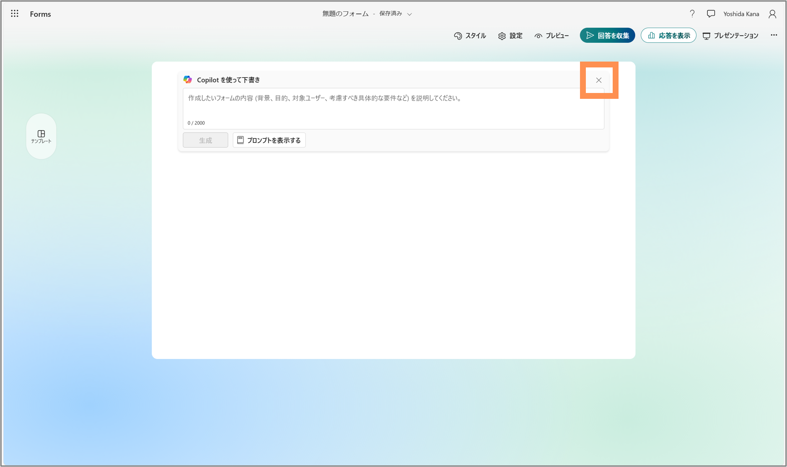
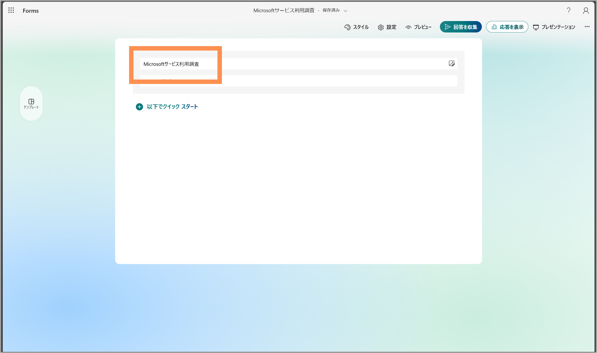
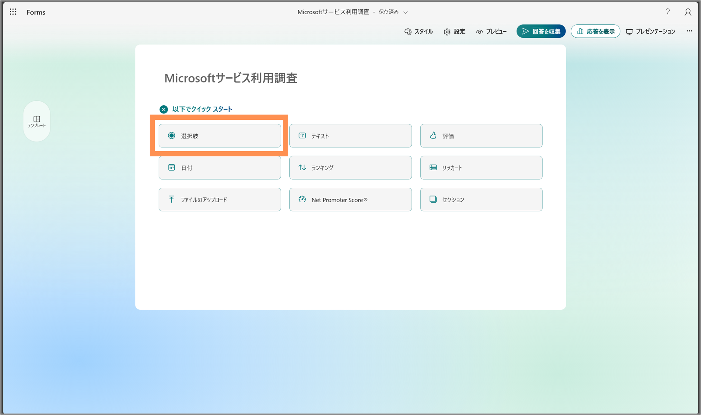
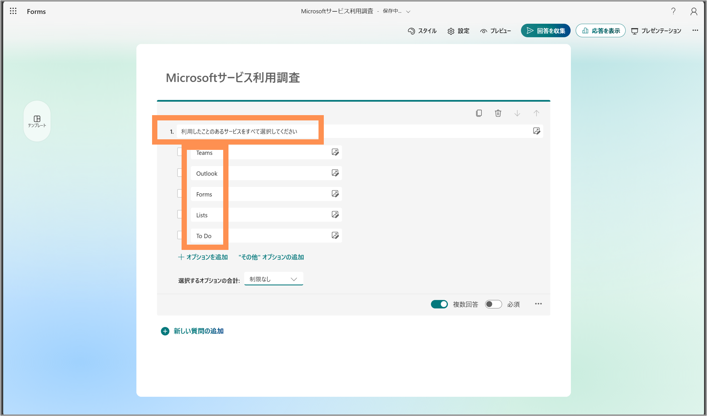
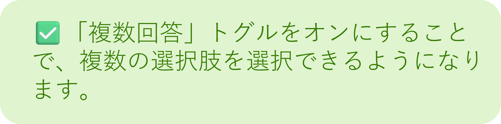
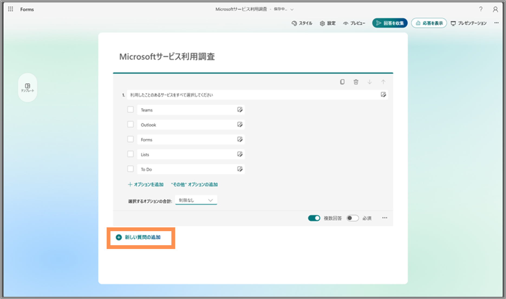
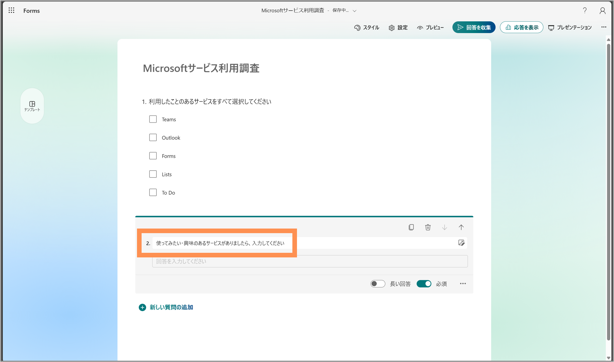

# アンケートの作成

【Microsoft 365 Copilotライセンスがある場合】

Copilotを使って自動的に設問を作成できます
今回は手動で行うので、「×」をクリックします

【Microsoft 365 Copilotライセンスがない場合】

手動での作成になります

「無題のタイトル」をクリックし、タイトルを編集します。

設問を作成します。

入力形式を選択します。
今回は「選択肢」を選択します。

質問と選択肢を入力します

さらに質問を追加します

「新しい質問の追加」をクリックします

先ほどと同様に、質問を作成していきます。

今回は「テキスト」を選択し、質問を入力します。

---
 [Formsにアクセスする](./01_access.md) ⬅️ | [🏠](00_README.md) | ➡️ [アンケートの設定](./03_setting.md)