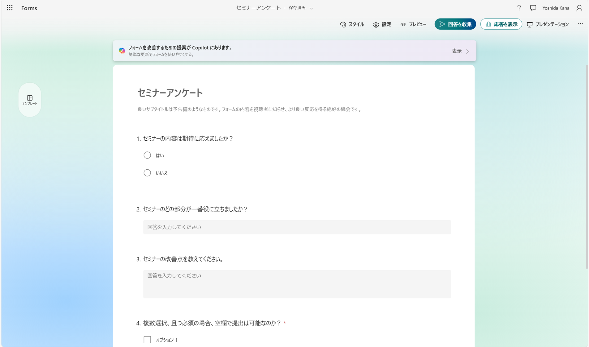

# Getting-started-with-Microsoft-Forms
Microsoft Formsを始めるための、チュートリアルです。Microsoft365の概要や、Formsの基本的な使い方を学びます。

# 目次
* [概要](./README.md)
* [Formsにアクセスする](./01_access.md)
* [アンケートを作成する](02_createsurvey.md)
* [アンケートの設定](03_setting.md)
* [アンケートのデザイン](04_design.md)
* [アンケートの配布](05_share.md)
* [回答の表示](06_showtheanswer.md)
* [演習](07_exercise.md)
* [まとめ](08_summary.md)
 
# Microsoft 365とは
 Office 365をはじめとしたMicrosoftの様々なアプリを、サブスクリプション契約で利用できるサービスです。

Word, Excel, PowerPointなどのアプリを、クラウド（インターネット）に接続して利用することで、
常に最新のバージョンでアプリを利用できたり、
社内の人と簡単にファイル共有を行うことができます。

# Microsoft Formsとは
アンケート・テスト作成ツールです

アンケートは条件分岐や入力制限などの様々な設定ができたり、
採点やグラフ化も行うことができます。

# Microsoft Formsのチュートリアル
次のページから、実際のMicrosoft Formsについて学びます。

---
 [🏠](README.md) | ➡️ [Formsにアクセスする](01_access.md)
