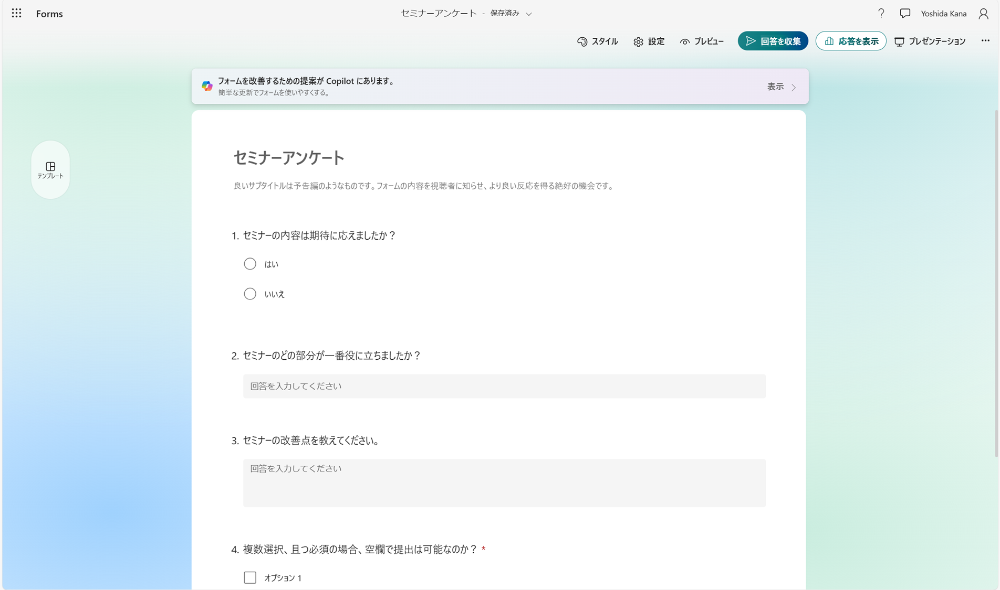

# Getting-started-with-Microsoft-Forms
Microsoft Formsを始めるための、チュートリアルです。Microsoft365の概要や、Formsの基本的な使い方を学びます。

# 目次
* [Microsoft 365とは](./README.md)
* [Microsoft Forms](./_____md)
 
# Microsoft 365とは
 Office 365をはじめとしたMicrosoftの様々なアプリを、サブスクリプション契約で利用できるサービスです。

Word, Excel, PowerPointなどのアプリを、クラウド（インターネット）に接続して利用することで、
常に最新のバージョンでアプリを利用できたり、
社内の人と簡単にファイル共有を行うことができます。

# Microsoft Formsとは
アンケート・テスト作成ツールです

アンケートは条件分岐や入力制限などの様々な設定ができたり、
採点やグラフ化も行うことができます。

# Microsoft Formsのチュートリアル
次のページから、実際のMicrosoft Formsについて学びます。

---
 [🏠](./README.md) | ➡️ [Microsoft Formsのチュートリアル](./_____.md)
